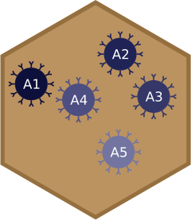

# beadplexr 

[](https://travis-ci.org/ustervbo/beadplexr)

Reproducible and easy analysis and evaluation of LEGENDplex, CBA, and MACSPlex experiments.

The companies behind the above beadplex systems, provide their own software for the analysis of the generated data. However, the strong dependence on manual interaction make the respective solutions labour insensitive and above all not always reproducible.

## Installation

``` 
# The development version from GitHub:
# install.packages("devtools")
devtools::install_github("ustervbo/beadplexr")
#
# Or with vignettes built
# devtools::install_github("ustervbo/beadplexr", build_vignettes = TRUE)
```

## Getting started

```
library(beadplexr)
```

The package comes with a comprehensive example in the vignette 'Analysis of LEGENDplex data with beadplexr':

```
vignette("LEGENDplex-beadplexr")
```
